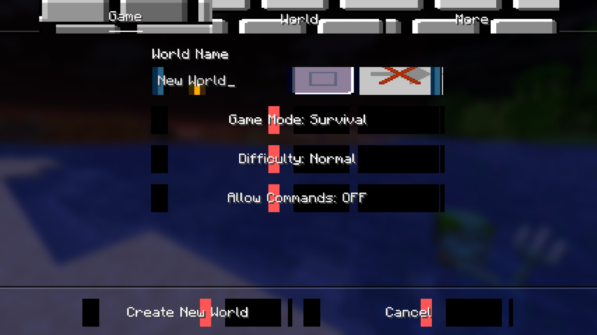
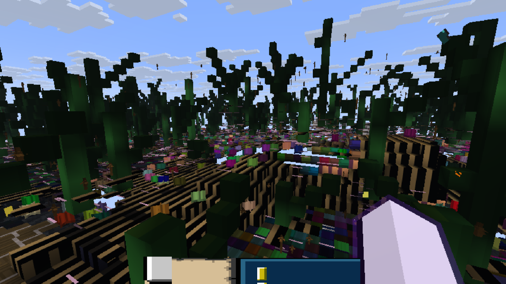

# TextureCorrupter

Corrupts minecraft textures
- The mod now works (i hope) - kizzy-june

## Some info
- The texture corruption changes depending on how the texture filtering, the anisotropic filtering level and mipmap level is set.
- This mod is for fabric 1.21.11 and requires fabric API.
- Icon art by0NULLVOID0

## Gallery
- Gallery 1

- Gallery 2

- Gallery 3

